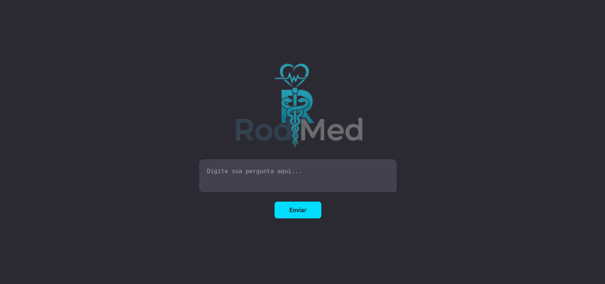

# Aprenda sobre doenças com RodMed
<p align="justify">
  Neste projeto foi feita a raspagem de dados do  <a href="https://www.gov.br/saude/pt-br/assuntos/saude-de-a-a-z">site de doenças</a>  do Ministério da Saúde.Usando LLM criei uma RAG que 
  reponde perguntas   sobre saúde.O projeto está hospedado no Heroku e se conecta com o Zilliz Cloud, um banco de dados Milvus auto gerenciado.Utilizei como Sentence Transformer o modelo
  all-MiniLM-L6-v2, que reduziu bastante o tamanho do container,já que o limite do Heroku é 2GB.
</p>

Tecnologias:

   - Linguagem: Python 3.9

   - Servidor Web: Flask + Gunicorn

   - Banco de Vetores: Milvus (Zilliz Cloud)

   - Modelo de IA: OpenAI (GPT) + SentenceTransformers (Local)

   - Infraestrutura: Docker + Heroku (Container Registry)

<p align="center">
  
Sistema Construído

</p>


<a href="https://www.linkedin.com/posts/cientista-de-dados1_llm-ministeriodasaude-rag-activity-7410728357278941184-G9D4?utm_source=share&utm_medium=member_desktop&rcm=ACoAAAUblZMBhr9goiDPfQ2w_j09X_HZjjrcfYU">Veja o video do sistema no seu PC(no celular ficou pequeno)</a>

### Como subir no Heroku
<p align="justify">
Subir uma API Python para o Heroku utilizando Docker é uma excelente escolha, especialmente quando você tem dependências específicas como o SDK do Milvus (Zilliz). O Heroku utiliza o **Container Registry** para esse processo.

Aqui está o roteiro completo para configurar e realizar o deploy:

---
Abra sua conta no <a href="https://www.heroku.com/">Heroku</a> e <a href="https://cloud.zilliz.com/login">Zilliz Cloud</a> se ainda nao tiver uma.

### 1. Preparação dos Arquivos Locais

Certifique-se de que sua estrutura de pastas contenha os três arquivos essenciais:

* **`app.py`**: Seu código da API (Flask, FastAPI, etc.).
* **`requirements.txt`**: Liste todas as bibliotecas, incluindo `pymilvus`.
* **`Dockerfile`**: As instruções de build da imagem.

### 2. Configurando o Dockerfile
<p align="justify">
Para o Heroku, o Dockerfile precisa ser otimizado. O ponto mais importante é que o Heroku ignora a porta que você define no Dockerfile e atribui uma porta dinâmica através da variável de ambiente `$PORT`.
Nao se preocupe,isto ja está no dockerfile,
estou mostrando apenas para conhecimento.
</p>
 **Nota:** Se estiver usando FastAPI, o comando seria:
 `CMD uvicorn main:app --host 0.0.0.0 --port $PORT`

---

### 3. Conexão com Zilliz Cloud (Segurança)
<p align="justify">
**Nunca** coloque suas credenciais (URI e Token) direto no código. No seu script Python, use variáveis de ambiente.
Nao se preocupe,isto ja está no código python,estou mostrando apenas para conhecimento.

</p> 

```python
import os
from pymilvus import connections

ZILLIZ_URI = os.getenv("ZILLIZ_CLOUD_URI")
ZILLIZ_TOKEN = os.getenv("ZILLIZ_CLOUD_TOKEN")

connections.connect(
    alias="default",
    uri=ZILLIZ_URI,
    token=ZILLIZ_TOKEN
)

```
### 4. Deploy via Heroku CLI

Abra o terminal na pasta do projeto e siga estes comandos:

1. **Login no Heroku e no Container Registry:**
```bash
heroku login
heroku container:login

```


2. **Criar o App (se ainda não existir):**
```bash
heroku create nome-do-seu-app

```


3. **Configurar as Variáveis de Ambiente no Heroku:**
Vá ao painel do Heroku ou use o terminal para adicionar os dados do Zilliz:
```bash
heroku config:set ZILLIZ_CLOUD_URI=https://sua-uri.zillizcloud.com
heroku config:set ZILLIZ_CLOUD_TOKEN=seu-token-aqui
heroku config:set OPENAI_API_KEY=sua_key_aqui

```


4. **Build e Push da Imagem:**
```bash
heroku container:push web -a nome-do-seu-app

```


5. **Release (Colocar no ar):**
```bash
heroku container:release web -a nome-do-seu-app

```


---

### 5. Verificação

Após o release, você pode acompanhar os logs para ver se a conexão com o Milvus foi estabelecida com sucesso:

```bash
heroku logs --tail -a nome-do-seu-app

```

---
<p align="justify">
**Dica Extra:** Como o Zilliz Cloud exige conexão segura, certifique-se de que a biblioteca `pymilvus` no seu `requirements.txt` esteja atualizada para evitar problemas de compatibilidade com o gRPC no ambiente Linux do Docker.
</p>
Testando

curl -s -X POST sua_url_heroku/sac \

-H "Content-Type: application/json" \
     
-d '{"pergunta": "Como evitar a dengue?"}' | python3 -c "import sys, json;  \

print(json.dumps(json.load(sys.stdin), ensure_ascii=False, indent=2))"
